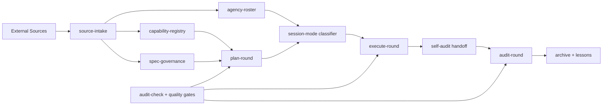

# arcgentic v1.0.0 — OpenSpec + Superpowers Marketplace Design

## 1. Problem framing

arcgentic v0.2.2-alpha.3 already provides the round state machine, role skills, audit
fact checks, lesson codification, reference tracking, cross-session handoff, and Python
CLI gates. The v1.0.0 upgrade should make the upstream planning and capability context
more explicit without weakening the existing enforcement model.

Two external workflow sources are being fused:

- `obra/superpowers-marketplace`: a Claude Code marketplace catalog for skills,
  workflows, and productivity plugins.
- `wearetechnative/awesome-openspec`: an OpenSpec / Spec-Driven Development resource
  catalog that also dogfoods OpenSpec-style `proposal.md`, `design.md`, `tasks.md`,
  `specs/`, and `archive/` artifacts.
- `msitarzewski/agency-agents` and `jnMetaCode/agency-agents-zh`: AI specialist role
  catalogs organized by department, specialty, workflow, deliverables, and usage context.

The v1 goal is not to wrap either project directly. The goal is to absorb their useful
workflow patterns into arcgentic's own mechanically-verifiable round model.

## 2. Source facts

### 2.1 Superpowers Marketplace facts

- The marketplace has a `.claude-plugin/marketplace.json` catalog with plugin entries.
- Each entry includes a plugin `name`, source URL or local source descriptor, `version`,
  `description`, and `strict` flag.
- The current catalog includes workflow/capability plugins such as `superpowers`,
  `superpowers-chrome`, `episodic-memory`, `superpowers-lab`,
  `superpowers-developing-for-claude-code`, `claude-session-driver`, and
  `double-shot-latte`.
- The useful arcgentic pattern is capability discovery from a signed/known catalog, not
  copying third-party skills into arcgentic.

### 2.2 Awesome OpenSpec facts

- OpenSpec is described as a spec-driven development workflow where user and assistant
  agree on what to build before code is written.
- The core lifecycle is proposal/spec/design/tasks before implementation, then archive
  after completion.
- The sample change `github-stats-script` contains `.openspec.yaml`, `proposal.md`,
  `design.md`, `tasks.md`, and delta `specs/`.
- The `.claude/skills` folder includes skills for proposing, applying, archiving, and
  exploring OpenSpec changes.
- The useful arcgentic pattern is a persistent spec artifact graph, not taking a Node CLI
  dependency.

### 2.3 Agency Agents facts

- `msitarzewski/agency-agents` is an MIT-licensed catalog of specialized AI agent roles
  grouped by divisions such as engineering, design, product, project management, testing,
  support, finance, marketing, sales, and specialized roles.
- Its agent design guidance requires each role to define identity, mission, critical rules,
  deliverables, workflow process, communication style, learning/memory, success metrics, and
  advanced capabilities.
- `jnMetaCode/agency-agents-zh` is an MIT-licensed Chinese community edition. It declares
  215 roles, 17 supported tools, 18 departments, translated upstream coverage, and additional
  China-market roles.
- The useful arcgentic pattern is role cataloging and identity handoff, not wholesale role
  import. arcgentic should select role families for a round and generate identity prompts,
  while retaining its own planner/developer/auditor state machine.

## 3. V1 scope

### 3.1 In scope

- Add a source-intake model that records external workflow sources as auditable inputs.
- Add a capability-registry model for marketplace-style plugin catalogs.
- Add OpenSpec-style artifact governance for proposals, designs, tasks, delta specs, and
  archives.
- Map OpenSpec artifacts into arcgentic handoff and audit surfaces.
- Extend `plan-round` so V1 planning can read capability registry and spec artifacts.
- Extend `execute-round` so implementation tasks can be traced back to spec tasks.
- Extend audit checks so V1 release readiness verifies manifest/version/docs alignment.
- Add a pre-mode classifier that recommends single-session or multi-session execution before
  the user chooses.
- Add agency-style role catalog ingestion for multi-agent dispatch and identity handoff.
- Publish v1.0.0 as a stable release only after dogfood gates pass.

### 3.2 Out of scope

- No hard dependency on the OpenSpec npm package.
- No vendoring or copying Superpowers Marketplace plugin code.
- No automatic installation of third-party plugins.
- No background marketplace polling.
- No paid API calls.
- No new hosted service.
- No broad UI/dashboard.
- No Moirai-specific rule names or project facts.

## 4. Architecture



## 5. New module seams

### 5.1 `source-intake`

Purpose: normalize external workflow sources into auditable records.

Interface:

- Input: repo URL, raw file URL, local path, or marketplace catalog path.
- Output: source record with `id`, `kind`, `origin`, `retrieved_at`, `revision`,
  `license`, `used_parts`, `excluded_parts`, and `rt_tier`.
- Error modes: inaccessible source, unsupported source kind, missing license, malformed
  catalog, duplicate source id.

Depth: medium. The interface hides fetch/parsing details while preserving enough evidence
for audits.

### 5.2 `capability-registry`

Purpose: parse marketplace-style catalogs and expose available capabilities to planning.

Interface:

- Input: source-intake record pointing to a marketplace JSON file.
- Output: capability list with `name`, `version`, `source`, `strict`, `category`,
  `description`, and normalized tags.
- Error modes: invalid JSON, missing plugin name, unsupported source type, duplicate
  capability identity.

Depth: real seam. There are at least two known adapters:

- Superpowers-style `.claude-plugin/marketplace.json`.
- Codex/OpenAI-style `.agents/plugins/marketplace.json`.

### 5.3 `spec-governance`

Purpose: represent OpenSpec-style changes without requiring OpenSpec CLI.

Interface:

- Input: `openspec/changes/<change>/` directory or arcgentic-native spec directory.
- Output: artifact graph containing proposal, design, tasks, delta specs, status, and
  archive target.
- Error modes: missing required artifact, dependency order violation, incomplete tasks,
  unsynced delta specs, archive conflict.

Depth: high. It gives arcgentic a spec artifact graph while keeping implementation
independent of one vendor CLI.

### 5.4 `agency-roster`

Purpose: parse agency-agents-style role catalogs into normalized role families.

Interface:

- Input: local role catalog path, GitHub repo snapshot, or source-intake record.
- Output: agent role entries with `department`, `role_name`, `source_path`, `specialty`,
  `when_to_use`, `deliverables`, `workflow_phases`, and `language`.
- Error modes: malformed role file, missing identity, missing deliverables, duplicate role
  identity, unsupported catalog layout.

Depth: real seam. Known adapters:

- English agency-agents layout: department directories with Markdown role files.
- Chinese agency-agents-zh layout: department directories plus `CATALOG.md` and upstream
  mapping metadata.

### 5.5 `session-mode classifier`

Purpose: recommend execution mode before asking the user to choose.

Interface:

- Input: handoff metadata, task count, expected duration, touched surface count, risk flags,
  dispatch availability, and candidate agency roles.
- Output: recommendation object with `recommended_mode`, `confidence`, `reasons`,
  `candidate_roles`, `requires_user_confirmation`, and identity handoff prompts.
- Error modes: missing handoff, unknown risk profile, dispatch unavailable but
  single-session requested, no suitable role identity for required work.

Depth: high. It concentrates the decision logic that otherwise leaks into every
orchestrator prompt.

## 6. Artifact mapping

| OpenSpec artifact | arcgentic artifact | V1 behavior |
|---|---|---|
| `proposal.md` | handoff § problem / scope / non-scope | Planner must summarize proposal facts |
| `design.md` | handoff architecture / implementation strategy | Planner cites design decisions and alternatives |
| `tasks.md` | execute-round task list | Developer checks off tasks only after verification |
| `specs/*/spec.md` | audit requirement facts | Auditor verifies implemented behavior against spec |
| `archive/YYYY-MM-DD-*` | closed round archive | Lesson codifier can mine archived changes |

## 7. State-machine changes

V1 keeps the current round states. It adds optional metadata, not new mandatory states:

```yaml
current_round:
  source_intake:
    - id: superpowers-marketplace
      kind: marketplace
      rt_tier: RT0
  spec_change:
    name: arcgentic-v1-openspec-superpowers
    schema: spec-driven
    proposal: docs/specs/...
    design: docs/specs/...
    tasks: docs/specs/...
  capability_registry:
    path: docs/capabilities/registry.json
    count: 10
```

Reason: adding states for every spec phase would duplicate OpenSpec. arcgentic's state
machine should remain the enforcement layer for rounds, while spec-governance owns the
artifact graph.

## 8. Session Mode Classifier + Gate

Before `awaiting_dev_start -> dev_in_progress`, arcgentic must first recommend an execution
mode, then force an explicit user decision. This is a workflow entry seam, not a
convenience prompt.

### 8.1 Classifier heuristic

Recommend `single-session` when all are true:

- expected duration is short, normally less than one focused day;
- implementation touches a small local surface, normally fewer than 10 files;
- no schema migration, release tag, public package publication, security-sensitive change,
  or cross-repo dependency is involved;
- audit independence can be preserved by a sub-agent or by narrow local verification;
- sub-agent dispatch transport is available if automatic audit is requested.

Recommend `multi-session` when any are true:

- expected work spans multiple days or multiple commits with materially different roles;
- the round changes workflow contracts, release gates, security boundaries, package
  manifests, or external integrations;
- independent external audit is strategically important;
- multiple agency roles are needed and their outputs should not contaminate each other;
- dispatch transport is unavailable or unverified.

The classifier must show its reasons and still ask the user to confirm or override.

### 8.2 Mode A — single-session orchestrator

Current session identity: orchestrator.

Behavior:

- Orchestrator dispatches planner, developer, BA, CR, SE, lesson-codifier, and auditor
  sub-agents inside one session.
- Developer work may trigger audit automatically only if the sub-agent dispatch transport
  is mechanically verified.
- If dispatch fails or is unavailable, the workflow must degrade to manual verified
  execution and record the failure as an adapter finding. It must not claim full
  single-session automation.

### 8.3 Mode B — multi-session identity handoff

Current session identity: orchestrator/planner until handoff is complete.

Behavior:

- Orchestrator stops at `awaiting_dev_start`.
- Orchestrator emits a Dev Session identity prompt with handoff path, round id, allowed
  scope, required gates, and stop condition.
- User opens a separate developer session and pastes the identity prompt.
- After developer self-audit, orchestrator emits an Audit Session identity prompt.
- Audit session must not share developer role identity and must independently verify facts.

### 8.4 Agency-style role routing

When the classifier recommends multi-session, it must also recommend identity prompts for
specific role families. For arcgentic V1, the default set is:

- Orchestrator / project shepherd: owns state, mode gate, and handoff prompts.
- Software architect: validates module seams and tradeoffs.
- Minimal-change engineer or senior developer: implements narrow code slices.
- Code reviewer: checks maintainability, coupling, and regressions.
- Security engineer: checks threat surfaces and secret/config handling.
- Auditor: writes external verdict and re-runs facts.

These are role families. arcgentic may map them to built-in agents, agency-agents catalog
entries, or local user-provided roles.

### 8.5 Required UX

At the mode gate, arcgentic must ask the user to choose:

- `single-session`: one session dispatches sub-agents and starts audit automatically after
  dev, if dispatch transport is verified.
- `multi-session`: current session stops and prints identity handoff prompts for separate
  dev/audit sessions.

Before showing that choice, it must print a recommendation:

- `Recommendation`
- `Confidence`
- `Reasons`
- `Suggested role identities`
- `Override instructions`

No implementation work should begin before this gate is resolved.

## 9. CLI changes

Proposed commands:

```bash
arcgentic source-intake add <source> --kind marketplace|openspec|repo|doc
arcgentic capability-registry build --sources docs/source-intake/*.yaml
arcgentic spec-governance status <change-dir>
arcgentic spec-governance validate <change-dir>
arcgentic spec-governance archive <change-dir>
arcgentic agency-roster inspect <catalog-path>
arcgentic session-mode recommend --round <round> --handoff <path>
arcgentic session-mode prompt --round <round> --handoff <path> --mode single|multi
arcgentic v1-release-readiness --repo-root .
```

Existing commands stay:

```bash
arcgentic audit-check
arcgentic validate-handoff
arcgentic quality-gate-enforce
arcgentic codify-lesson
arcgentic track-refs
arcgentic cross-session-handoff
```

## 10. Skill changes

### 10.1 New skill: `source-intake`

Trigger: when a user provides external workflows, reference repos, marketplace catalogs,
OpenSpec resources, or asks to fuse outside workflow material into a round.

Responsibilities:

- classify source tier;
- record source triplet;
- extract capability/spec facts;
- refuse direct dependency if a source is only RT0/RT1.

### 10.2 New skill: `spec-governance`

Trigger: when a round uses proposal/design/tasks/spec/archive artifacts.

Responsibilities:

- validate artifact graph;
- map proposal/design/tasks to handoff sections;
- surface incomplete tasks before audit;
- assess archive readiness.

### 10.3 New skill: `session-mode`

Trigger: when a round reaches `awaiting_dev_start`, when a user says "use the complete
arcgentic workflow", or when a developer/auditor session needs an identity handoff.

Responsibilities:

- declare the current session identity;
- recommend single-session or multi-session execution before asking the user to choose;
- verify whether single-session sub-agent dispatch is actually available;
- emit developer and auditor handoff prompts for multi-session mode;
- block dev start until mode is confirmed.

### 10.4 New skill: `agency-roster`

Trigger: when the user references agency-agents, wants role routing, or needs multi-agent
identity prompts.

Responsibilities:

- parse role catalog metadata;
- select role families for the current round;
- generate identity handoff prompts from role, deliverables, scope, and stop conditions;
- keep external role catalogs as references unless explicitly imported by the user.

### 10.5 Updated skills

- `plan-round`: include source intake and capability registry in handoff.
- `execute-round`: check task traceability and require session-mode confirmation before
  implementation.
- `audit-round`: verify artifact facts and release-readiness facts.
- `track-refs`: optionally consume source-intake records.
- `codify-lesson`: mine archived spec changes.

## 11. Test strategy

### Unit tests

- Parse Superpowers-style marketplace JSON.
- Parse Codex-style local marketplace JSON.
- Detect duplicate capability names.
- Validate OpenSpec-style artifact directory.
- Count complete/incomplete tasks.
- Detect archive target collision.
- Validate source-intake record schema.
- Generate single-session and multi-session identity prompts.
- Refuse single-session auto-audit when dispatch transport is unavailable.
- Recommend single-session for short low-risk local tasks.
- Recommend multi-session for release/workflow/security/cross-role rounds.
- Parse agency-agents-style role directories and `CATALOG.md` role paths.

### Integration tests

- Source intake from local fixture marketplace -> capability registry.
- OpenSpec-style change fixture -> handoff validation.
- Tasks complete -> spec-governance archive-ready.
- Incomplete tasks -> archive warning or failure depending strict mode.
- V1 release readiness catches manifest/version README drift.
- `awaiting_dev_start` produces a recommendation and mode choices before `dev_in_progress`.
- Multi-session mode emits developer and auditor identity handoff prompts.

### Regression tests

- Existing 277 toolkit tests must remain passing.
- Existing Bash state/gate tests must remain passing.
- Plugin validator must pass for repo and installed local symlink.

## 12. Release gates

V1 stable requires:

- `pytest` green.
- `mypy --strict` green.
- `ruff check` green.
- Bash gate tests green.
- Codex plugin validator green.
- Claude plugin manifest present and version-aligned.
- Codex plugin manifest present and version-aligned.
- `plugin.json`, `toolkit/pyproject.toml`, `README.md`, `README.zh-CN.md`, marketplace
  metadata all say `1.0.0`.
- V1 dogfood round has a self-audit handoff and external verdict.
- No source-intake record references a source without license/status classification.
- Dogfood evidence includes which session mode was selected and why.

## 13. Risks

- Coupling risk: making OpenSpec CLI mandatory would violate arcgentic's local Python/Bash
  portability.
- Scope risk: marketplace integration could become plugin management. V1 only discovers
  and records capabilities.
- Audit risk: spec artifacts can become narrative-only. V1 must convert them into
  mechanical audit facts.
- Release risk: version surfaces have drifted before. V1 needs a dedicated release
  readiness gate.
- Identity risk: if the current session role is implicit, developer and auditor roles can
  contaminate each other. The session-mode gate must make identity explicit before dev.

## 14. Recommended implementation order

1. Add fixtures for marketplace catalogs and OpenSpec-style changes.
2. Add fixtures for agency-agents English and Chinese role catalog shapes.
3. Implement session-mode classifier, prompt generation, and mode gate.
4. Implement agency-roster parser and role-family selector.
5. Implement source-intake data model and validator.
6. Implement capability-registry parser.
7. Implement spec-governance artifact graph validator.
8. Add CLI commands around those modules.
9. Update `plan-round`, `execute-round`, and `audit-round` skills.
10. Add V1 release-readiness gate.
11. Update README/plugin manifests to `1.0.0-alpha.1`.
12. Dogfood arcgentic-on-arcgentic V1 round.
13. External audit and promote to `1.0.0` only after Gate 3 portability proof.

## 15. Open decisions

- Whether V1 stable requires live Claude Code plugin loading proof, or local validator proof
  is enough for the first V1 release candidate.
- Whether source-intake records should be YAML for readability or JSON for strict schema
  enforcement.
- Whether `spec-governance archive` should physically move directories or only validate
  archive readiness in v1.0.0.
- Whether single-session mode in Codex should use Codex thread tools, multi-agent tools, or
  be marked unavailable until a real dispatch adapter exists.
- Whether agency role selection should be rule-based only in v1.0.0, or whether it should
  later support scored semantic matching.
