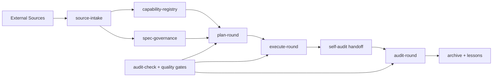

# arcgentic v1.0.0 — OpenSpec + Superpowers Marketplace Design

## 1. Problem framing

arcgentic v0.2.2-alpha.3 already provides the round state machine, role skills, audit
fact checks, lesson codification, reference tracking, cross-session handoff, and Python
CLI gates. The v1.0.0 upgrade should make the upstream planning and capability context
more explicit without weakening the existing enforcement model.

Two external workflow sources are being fused:

- `obra/superpowers-marketplace`: a Claude Code marketplace catalog for skills,
  workflows, and productivity plugins.
- `wearetechnative/awesome-openspec`: an OpenSpec / Spec-Driven Development resource
  catalog that also dogfoods OpenSpec-style `proposal.md`, `design.md`, `tasks.md`,
  `specs/`, and `archive/` artifacts.

The v1 goal is not to wrap either project directly. The goal is to absorb their useful
workflow patterns into arcgentic's own mechanically-verifiable round model.

## 2. Source facts

### 2.1 Superpowers Marketplace facts

- The marketplace has a `.claude-plugin/marketplace.json` catalog with plugin entries.
- Each entry includes a plugin `name`, source URL or local source descriptor, `version`,
  `description`, and `strict` flag.
- The current catalog includes workflow/capability plugins such as `superpowers`,
  `superpowers-chrome`, `episodic-memory`, `superpowers-lab`,
  `superpowers-developing-for-claude-code`, `claude-session-driver`, and
  `double-shot-latte`.
- The useful arcgentic pattern is capability discovery from a signed/known catalog, not
  copying third-party skills into arcgentic.

### 2.2 Awesome OpenSpec facts

- OpenSpec is described as a spec-driven development workflow where user and assistant
  agree on what to build before code is written.
- The core lifecycle is proposal/spec/design/tasks before implementation, then archive
  after completion.
- The sample change `github-stats-script` contains `.openspec.yaml`, `proposal.md`,
  `design.md`, `tasks.md`, and delta `specs/`.
- The `.claude/skills` folder includes skills for proposing, applying, archiving, and
  exploring OpenSpec changes.
- The useful arcgentic pattern is a persistent spec artifact graph, not taking a Node CLI
  dependency.

## 3. V1 scope

### 3.1 In scope

- Add a source-intake model that records external workflow sources as auditable inputs.
- Add a capability-registry model for marketplace-style plugin catalogs.
- Add OpenSpec-style artifact governance for proposals, designs, tasks, delta specs, and
  archives.
- Map OpenSpec artifacts into arcgentic handoff and audit surfaces.
- Extend `plan-round` so V1 planning can read capability registry and spec artifacts.
- Extend `execute-round` so implementation tasks can be traced back to spec tasks.
- Extend audit checks so V1 release readiness verifies manifest/version/docs alignment.
- Publish v1.0.0 as a stable release only after dogfood gates pass.

### 3.2 Out of scope

- No hard dependency on the OpenSpec npm package.
- No vendoring or copying Superpowers Marketplace plugin code.
- No automatic installation of third-party plugins.
- No background marketplace polling.
- No paid API calls.
- No new hosted service.
- No broad UI/dashboard.
- No Moirai-specific rule names or project facts.

## 4. Architecture



## 5. New module seams

### 5.1 `source-intake`

Purpose: normalize external workflow sources into auditable records.

Interface:

- Input: repo URL, raw file URL, local path, or marketplace catalog path.
- Output: source record with `id`, `kind`, `origin`, `retrieved_at`, `revision`,
  `license`, `used_parts`, `excluded_parts`, and `rt_tier`.
- Error modes: inaccessible source, unsupported source kind, missing license, malformed
  catalog, duplicate source id.

Depth: medium. The interface hides fetch/parsing details while preserving enough evidence
for audits.

### 5.2 `capability-registry`

Purpose: parse marketplace-style catalogs and expose available capabilities to planning.

Interface:

- Input: source-intake record pointing to a marketplace JSON file.
- Output: capability list with `name`, `version`, `source`, `strict`, `category`,
  `description`, and normalized tags.
- Error modes: invalid JSON, missing plugin name, unsupported source type, duplicate
  capability identity.

Depth: real seam. There are at least two known adapters:

- Superpowers-style `.claude-plugin/marketplace.json`.
- Codex/OpenAI-style `.agents/plugins/marketplace.json`.

### 5.3 `spec-governance`

Purpose: represent OpenSpec-style changes without requiring OpenSpec CLI.

Interface:

- Input: `openspec/changes/<change>/` directory or arcgentic-native spec directory.
- Output: artifact graph containing proposal, design, tasks, delta specs, status, and
  archive target.
- Error modes: missing required artifact, dependency order violation, incomplete tasks,
  unsynced delta specs, archive conflict.

Depth: high. It gives arcgentic a spec artifact graph while keeping implementation
independent of one vendor CLI.

## 6. Artifact mapping

| OpenSpec artifact | arcgentic artifact | V1 behavior |
|---|---|---|
| `proposal.md` | handoff § problem / scope / non-scope | Planner must summarize proposal facts |
| `design.md` | handoff architecture / implementation strategy | Planner cites design decisions and alternatives |
| `tasks.md` | execute-round task list | Developer checks off tasks only after verification |
| `specs/*/spec.md` | audit requirement facts | Auditor verifies implemented behavior against spec |
| `archive/YYYY-MM-DD-*` | closed round archive | Lesson codifier can mine archived changes |

## 7. State-machine changes

V1 keeps the current round states. It adds optional metadata, not new mandatory states:

```yaml
current_round:
  source_intake:
    - id: superpowers-marketplace
      kind: marketplace
      rt_tier: RT0
  spec_change:
    name: arcgentic-v1-openspec-superpowers
    schema: spec-driven
    proposal: docs/specs/...
    design: docs/specs/...
    tasks: docs/specs/...
  capability_registry:
    path: docs/capabilities/registry.json
    count: 10
```

Reason: adding states for every spec phase would duplicate OpenSpec. arcgentic's state
machine should remain the enforcement layer for rounds, while spec-governance owns the
artifact graph.

## 8. CLI changes

Proposed commands:

```bash
arcgentic source-intake add <source> --kind marketplace|openspec|repo|doc
arcgentic capability-registry build --sources docs/source-intake/*.yaml
arcgentic spec-governance status <change-dir>
arcgentic spec-governance validate <change-dir>
arcgentic spec-governance archive <change-dir>
arcgentic v1-release-readiness --repo-root .
```

Existing commands stay:

```bash
arcgentic audit-check
arcgentic validate-handoff
arcgentic quality-gate-enforce
arcgentic codify-lesson
arcgentic track-refs
arcgentic cross-session-handoff
```

## 9. Skill changes

### 9.1 New skill: `source-intake`

Trigger: when a user provides external workflows, reference repos, marketplace catalogs,
OpenSpec resources, or asks to fuse outside workflow material into a round.

Responsibilities:

- classify source tier;
- record source triplet;
- extract capability/spec facts;
- refuse direct dependency if a source is only RT0/RT1.

### 9.2 New skill: `spec-governance`

Trigger: when a round uses proposal/design/tasks/spec/archive artifacts.

Responsibilities:

- validate artifact graph;
- map proposal/design/tasks to handoff sections;
- surface incomplete tasks before audit;
- assess archive readiness.

### 9.3 Updated skills

- `plan-round`: include source intake and capability registry in handoff.
- `execute-round`: check task traceability before implementation.
- `audit-round`: verify artifact facts and release-readiness facts.
- `track-refs`: optionally consume source-intake records.
- `codify-lesson`: mine archived spec changes.

## 10. Test strategy

### Unit tests

- Parse Superpowers-style marketplace JSON.
- Parse Codex-style local marketplace JSON.
- Detect duplicate capability names.
- Validate OpenSpec-style artifact directory.
- Count complete/incomplete tasks.
- Detect archive target collision.
- Validate source-intake record schema.

### Integration tests

- Source intake from local fixture marketplace -> capability registry.
- OpenSpec-style change fixture -> handoff validation.
- Tasks complete -> spec-governance archive-ready.
- Incomplete tasks -> archive warning or failure depending strict mode.
- V1 release readiness catches manifest/version README drift.

### Regression tests

- Existing 277 toolkit tests must remain passing.
- Existing Bash state/gate tests must remain passing.
- Plugin validator must pass for repo and installed local symlink.

## 11. Release gates

V1 stable requires:

- `pytest` green.
- `mypy --strict` green.
- `ruff check` green.
- Bash gate tests green.
- Codex plugin validator green.
- Claude plugin manifest present and version-aligned.
- Codex plugin manifest present and version-aligned.
- `plugin.json`, `toolkit/pyproject.toml`, `README.md`, `README.zh-CN.md`, marketplace
  metadata all say `1.0.0`.
- V1 dogfood round has a self-audit handoff and external verdict.
- No source-intake record references a source without license/status classification.

## 12. Risks

- Coupling risk: making OpenSpec CLI mandatory would violate arcgentic's local Python/Bash
  portability.
- Scope risk: marketplace integration could become plugin management. V1 only discovers
  and records capabilities.
- Audit risk: spec artifacts can become narrative-only. V1 must convert them into
  mechanical audit facts.
- Release risk: version surfaces have drifted before. V1 needs a dedicated release
  readiness gate.

## 13. Recommended implementation order

1. Add fixtures for marketplace catalogs and OpenSpec-style changes.
2. Implement source-intake data model and validator.
3. Implement capability-registry parser.
4. Implement spec-governance artifact graph validator.
5. Add CLI commands around those modules.
6. Update `plan-round`, `execute-round`, and `audit-round` skills.
7. Add V1 release-readiness gate.
8. Update README/plugin manifests to `1.0.0-alpha.1`.
9. Dogfood arcgentic-on-arcgentic V1 round.
10. External audit and promote to `1.0.0` only after Gate 3 portability proof.

## 14. Open decisions

- Whether V1 stable requires live Claude Code plugin loading proof, or local validator proof
  is enough for the first V1 release candidate.
- Whether source-intake records should be YAML for readability or JSON for strict schema
  enforcement.
- Whether `spec-governance archive` should physically move directories or only validate
  archive readiness in v1.0.0.
